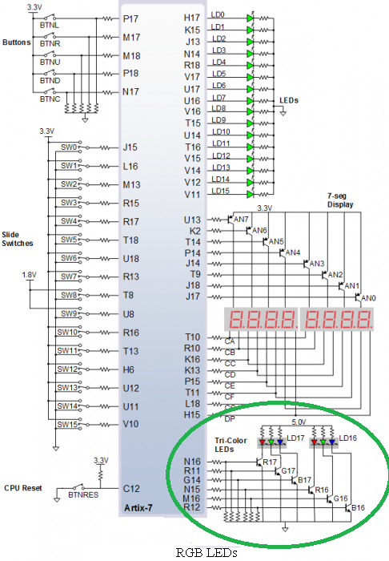
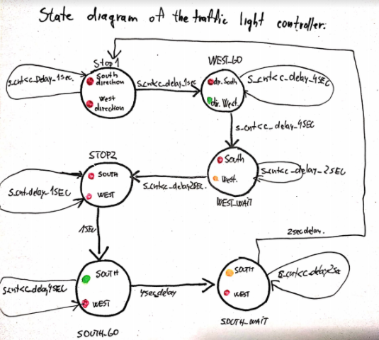

# Lab 08-traffic_lights 

### Preparation tasks
### Completed state table

| **Input P** | `0` | `0` | `1` | `1` | `0` | `1` | `0` | `1` | `1` | `1` | `1` | `0` | `0` | `1` | `1` | `1` |
| :-- | :-: | :-: | :-: | :-: | :-: | :-: | :-: | :-: | :-: | :-: | :-: | :-: | :-: | :-: | :-: | :-: |
| **Clock** |  |  |  |  |  |  |  |  |  |  |  |  |  |  |  |  |
| **State** | A | A | B | C | C | D | A | B | C | D | B | B | B | C | D | B |
| **Output R** | `0` | `0` | `0` | `0` | `0` | `1` | `0` | `0` | `0` | `1` | `0` | `0` | `0` | `0` | `1` | `0` |

### Figure with connection of RGB LEDs on Nexys A7 Board

### Completed table wiwth color settings 

| **RGB LEDs** | **Artix-7 pin names** | **Red** | **Yellow** | **Green** |
| :-:  |      :-:      |   :-:   |   :-:   |   :-:   |
| LD16 | N15, M16, R12 | `1,0,0` | `1,1,0` | `0,1,0` |
| LD17 | N16, R11, G14 | `1,0,0` | `1,1,0` | `0,1,0` |

### State diagram of Traffic light controller

### Listing of VHDL code of sequential process p_traffic_fsm with syntax highlighting
